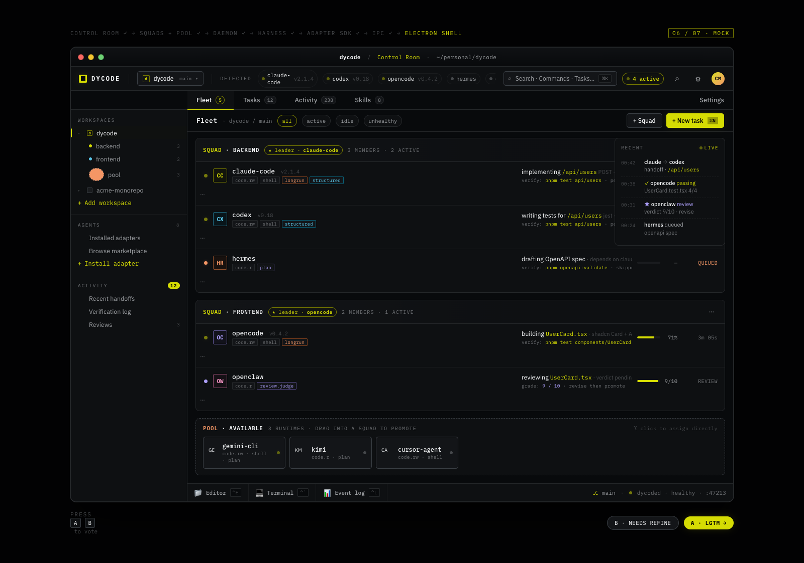
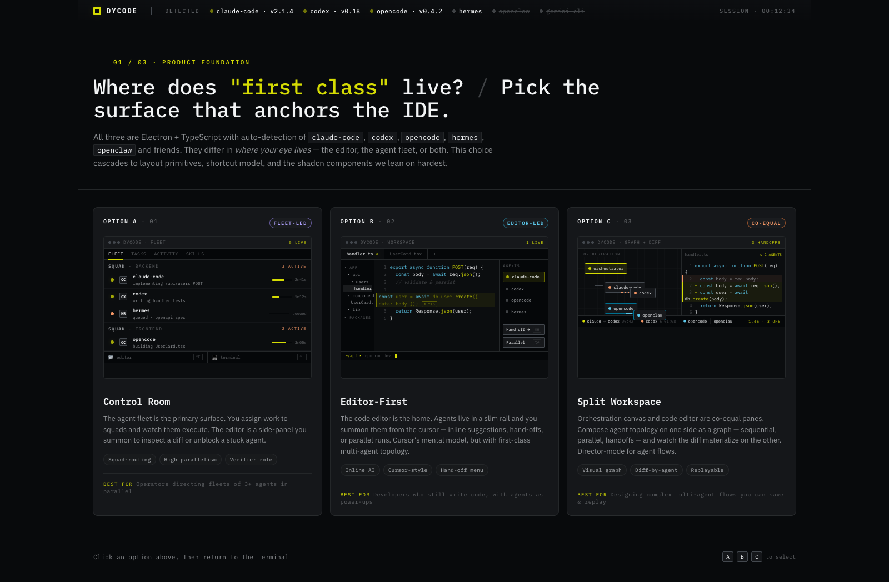
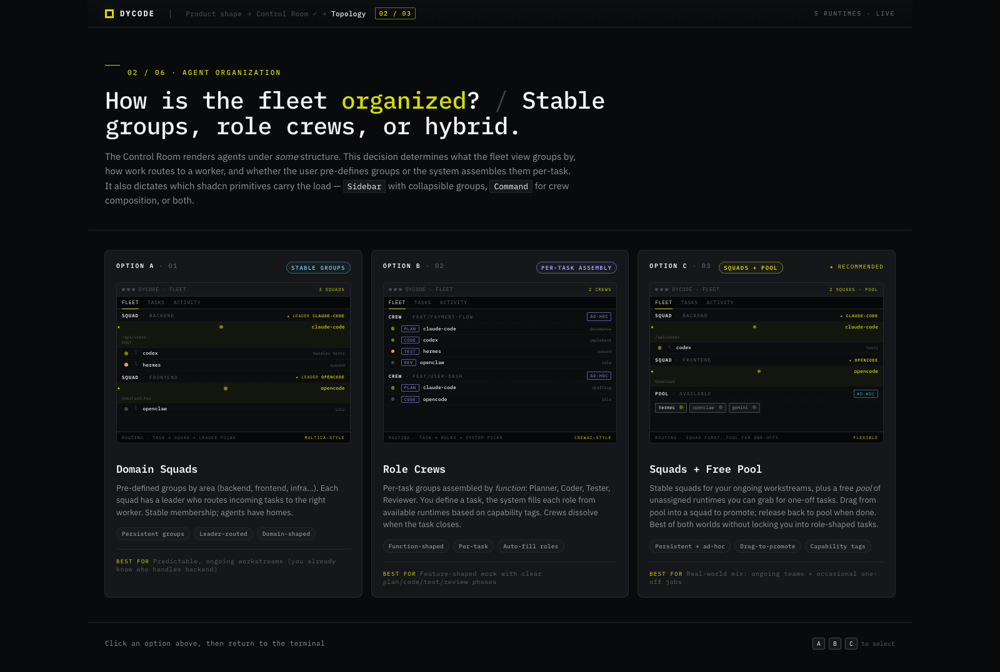
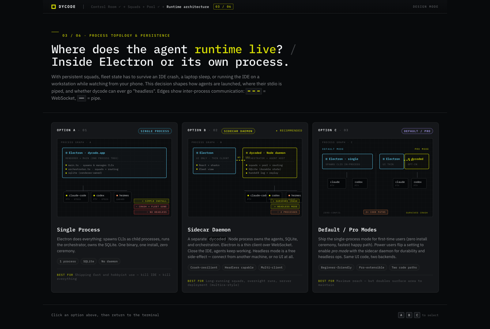
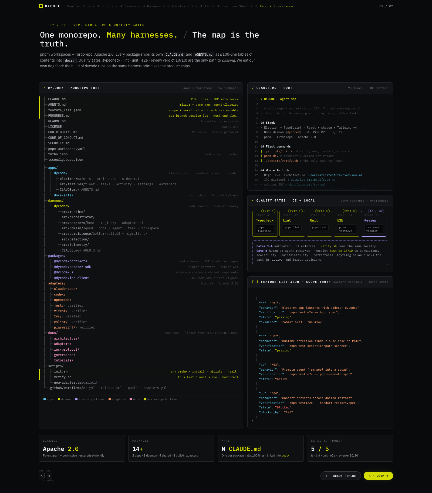

# dycode

> **A multi-agent orchestration IDE.** Auto-detect every AI coding CLI on your machine — Claude Code, Codex, OpenCode, Hermes, OpenClaw, Gemini-CLI, Cursor Agent, and more — and run them as a fleet. Stable named squads with a leader, plus an ad-hoc free pool, all orchestrated through a long-running sidecar daemon with first-class harness primitives.

Apache 2.0 · Electron + TypeScript · Pre-implementation (foundation + contracts shipped)



> Design mockup of the Fleet View — squads, agents, tasks, event log. Not a live screenshot; the renderer lands in [Plan 08](docs/superpowers/plans/2026-05-23-plan-08-electron-shell-skeleton.md).

---

## Why dycode

Every CLI-based AI coding agent has a different UX, a different invocation pattern, a different streaming format, and a different sense of "done." If you run more than one, you end up tabbing between terminals, copy-pasting context, and losing track of who did what.

dycode fixes that with three commitments:

1. **Plugin-first.** Any CLI can become a first-class agent by writing one adapter against [`@dycode/adapter-sdk`](packages/adapter-sdk/CLAUDE.md). Three flavors (`interactive`, `structured`, `oneshot`) cover the existing landscape; a fourth (`verifier`) gates work on real execution evidence.
2. **Fleet-first UI.** The Control Room renders your agents as the primary view — squads on the left, the free pool at the bottom, tasks and activity to the right. The code editor and terminal are summonable drawers, not the centerpiece.
3. **Harness-engineered from day one.** Every task carries an executable `verification` command. The state machine refuses to promote `active → passing` unless that command exits 0. Reviewers (≠ assignee) score work 0–10 on consistency, scalability, maintainability, correctness — anything under 10 blocks promotion. The event log is the source of truth; any task is replayable.

See the [design spec](docs/superpowers/specs/2026-05-23-dycode-design.md) for the full theory.

---

## Status

| Layer                                | State   | Tag               | Notes                                                                                 |
| ------------------------------------ | ------- | ----------------- | ------------------------------------------------------------------------------------- |
| Foundation (monorepo, CI, gates)     | shipped | `v0.0.1-plan-01`  | pnpm + Turborepo + Vitest + 5-gate verify pipeline                                    |
| `@dycode/contracts` (wire schemas)   | shipped | `v0.0.2-plan-02`  | Full IPC envelope + 29 RPC methods + domain entities, all Zod                         |
| `@dycode/adapter-sdk` (plugin API)   | shipped | `v0.0.2-plan-02`  | AdapterPlugin/Manifest/Event union — public contract                                  |
| `dycoded` daemon skeleton            | planned | `v0.0.3-plan-03`  | Tracked in [#1](https://github.com/carlomigueldy/dycode/issues/1) — full plan written |
| Adapter plugin host                  | planned | `v0.0.4-plan-04`  | [#2](https://github.com/carlomigueldy/dycode/issues/2)                                |
| `claude-code` adapter + task runtime | planned | `v0.0.5-plan-05`  | [#3](https://github.com/carlomigueldy/dycode/issues/3)                                |
| Verifier sub-type + `vitest`         | planned | `v0.0.6-plan-06`  | [#4](https://github.com/carlomigueldy/dycode/issues/4)                                |
| Orchestrator core                    | planned | `v0.0.7-plan-07`  | [#5](https://github.com/carlomigueldy/dycode/issues/5)                                |
| Electron shell skeleton              | planned | `v0.0.8-plan-08`  | [#6](https://github.com/carlomigueldy/dycode/issues/6)                                |
| Fleet view                           | planned | `v0.0.9-plan-09`  | [#7](https://github.com/carlomigueldy/dycode/issues/7)                                |
| `codex` + `opencode` adapters        | planned | `v0.0.10-plan-10` | [#8](https://github.com/carlomigueldy/dycode/issues/8)                                |
| Remaining verifiers (jest, tsc, …)   | planned | `v0.0.11-plan-11` | [#9](https://github.com/carlomigueldy/dycode/issues/9)                                |
| Task lifecycle UI                    | planned | `v0.0.12-plan-12` | [#10](https://github.com/carlomigueldy/dycode/issues/10)                              |
| Activity + Replay UI                 | planned | `v0.0.13-plan-13` | [#11](https://github.com/carlomigueldy/dycode/issues/11)                              |
| Settings + Adapters tab              | planned | `v0.0.14-plan-14` | [#12](https://github.com/carlomigueldy/dycode/issues/12)                              |
| Packaging (signed installers)        | planned | `v0.0.15-plan-15` | [#13](https://github.com/carlomigueldy/dycode/issues/13)                              |
| Docs site + adapter quickstart       | planned | `v0.0.16-plan-16` | [#14](https://github.com/carlomigueldy/dycode/issues/14)                              |
| **Public beta**                      | planned | `v0.1.0-beta.1`   | [#15](https://github.com/carlomigueldy/dycode/issues/15)                              |

Full roadmap with status per plan: [**`docs/superpowers/plans/README.md`**](docs/superpowers/plans/README.md).

---

## Design previews

These are pre-implementation mockups produced during the brainstorming + design phase. They lock the visual language (oklch dark palette, IBM Plex Mono + Sans, acid-lime accent) and the product shape. The interactive HTML originals are under [`docs/previews/`](docs/previews/) — open them in a browser for full fidelity.

### Product shape — fleet-first, not editor-first

[](docs/previews/01-product-shape.html)

Three options were considered: editor-first (the VS Code anchor), split workspace (50/50 fleet + editor), and **Control Room** (fleet is the page, editor is a drawer). Control Room wins because the fleet _is_ the primary thing being managed in this product — code editing is a secondary action you summon when needed.

### Fleet topology — squads, crews, or hybrid

[](docs/previews/02-orchestration-topology.html)

dycode picks **Squads + Free Pool**: stable named groups with a designated leader for ongoing work, plus an unaffiliated pool for ad-hoc tasks. Squads collapse to a single line in the Sidebar; the Command palette (`⌘K`) lets you target a specific agent or "any in squad X" for ergonomics.

### Runtime architecture — sidecar daemon over WebSocket JSON-RPC

[](docs/previews/03-runtime-architecture.html)

The agent runtime lives in `dycoded` — a long-running Node sidecar that owns squads, the pool, tasks, the hand-off log, SQLite state, and the adapter plugin host. Electron is a thin client that talks to the daemon over `ws://127.0.0.1:<port>` with a per-session bearer token. Closing the IDE doesn't kill agents in flight; reopening reattaches to the same fleet. Headless mode (no Electron) is supported from day one — future web/mobile companions can speak the same protocol with zero daemon changes.

### Repo + governance — one monorepo, many harnesses

[](docs/previews/05-repo-governance.html)

Every package ships its own ≤100-line `CLAUDE.md` / `AGENTS.md` map that lives as a table of contents into `docs/`. The root maps are the entry point; agents (human or LLM) follow links from there. The `feature_list.json` carries scope-of-record with executable verification commands. CI runs the same `scripts/verify.sh` that every contributor runs locally — same gates, same exit codes.

---

## Stack

| Layer       | Choice                                                                                            |
| ----------- | ------------------------------------------------------------------------------------------------- |
| Shell       | Electron + TypeScript · React 19 · shadcn UI · Tailwind v4 · Vite                                 |
| State       | Zustand (UI) · TanStack Query (server state) · React Hook Form + Zod (forms)                      |
| Routing     | TanStack Router                                                                                   |
| Daemon      | Node 22 · TypeScript strict · Hono (HTTP) · `@hono/node-ws` + `ws` (WebSocket) · `better-sqlite3` |
| IPC         | WebSocket JSON-RPC 2.0 with Zod-validated envelopes · per-session bearer token                    |
| Persistence | SQLite (WAL, foreign_keys ON) · forward-only migrations with integrity verify                     |
| Tooling     | pnpm 9 workspaces · Turborepo 2 · ESLint 9 (flat) · Prettier 3 · Vitest 2                         |
| Aesthetic   | oklch dark palette · IBM Plex Mono + Sans · acid-lime accent · brutalist density                  |
| License     | Apache 2.0 — single license across the monorepo (explicit patent grant)                           |

---

## Quickstart

> The app isn't installable yet — Plan 08 (Electron shell) is the first runnable surface. Today you can read the contracts, run the test suite, and follow the plan roadmap.

```bash
git clone https://github.com/carlomigueldy/dycode.git
cd dycode

./scripts/init.sh          # env probe + pnpm install + health check
./scripts/verify.sh        # the 5-gate quality pipeline (typecheck/lint/format/test)
pnpm test:watch            # iterative dev loop
```

Once Plan 03 lands, you'll be able to:

```bash
dycoded start              # long-running daemon
dycoded status             # one-line status check
dycoded stop               # graceful shutdown
```

Once Plan 08 lands, `pnpm dev` will start the Electron app, which spawns the daemon automatically and connects over the local WebSocket.

---

## How it works

```
┌─────────────────────────────────────────────────────────────────────────┐
│  USER MACHINE                                                            │
│                                                                          │
│  ┌──────────────────────────┐         ┌───────────────────────────────┐ │
│  │  dycode.app  (Electron)  │  ws://  │  dycoded  (Node/TS daemon)    │ │
│  │  · React + shadcn UI     │ ◄─────► │  · orchestrator core          │ │
│  │  · Vite + TanStack Query │ JSON-RPC│  · workspace registry         │ │
│  │  · Monaco editor (drawer)│  2.0    │  · adapter plugin host        │ │
│  └──────────────────────────┘         │  · sqlite (better-sqlite3)    │ │
│                                       │  · http + ws server (Hono)    │ │
│                                       └──────────────┬────────────────┘ │
│                                                      │ spawns + manages │
│                                                      ▼                  │
│                          ┌────────────────────────────────────────┐    │
│                          │  Adapter processes (one per agent)     │    │
│                          │  · claude-code · codex · opencode      │    │
│                          │  · hermes · openclaw · gemini-cli      │    │
│                          │  · vitest · jest · tsc · eslint · …    │    │
│                          └────────────────────────────────────────┘    │
└─────────────────────────────────────────────────────────────────────────┘
```

**Two stable contracts** decouple everything else:

- **IDE ↔ daemon** — WebSocket JSON-RPC 2.0, versioned, schema-validated. Any future client (web companion, mobile remote, CLI scripts) speaks this same protocol. See [`packages/contracts`](packages/contracts/CLAUDE.md).
- **Daemon ↔ adapter** — what every adapter implements. Capability negotiation, lifecycle hooks, event stream union. See [`packages/adapter-sdk`](packages/adapter-sdk/CLAUDE.md).

---

## Repository layout

```
dycode/
├── apps/                       # Electron app (Plan 08+) + docs site (Plan 16)
├── daemons/
│   └── dycoded/                # Sidecar daemon (Plan 03+)
├── packages/
│   ├── contracts/              # @dycode/contracts — Zod schemas + types   shipped
│   ├── adapter-sdk/            # @dycode/adapter-sdk — plugin contract     shipped
│   ├── ui/                     # @dycode/ui — shared shadcn primitives    (Plan 08)
│   └── ipc-client/             # @dycode/ipc-client — typed WS client     (Plan 03)
├── adapters/                   # Built-in adapters (Apache 2.0, Plans 05/06/10/11)
├── docs/
│   ├── superpowers/
│   │   ├── specs/              # The design spec
│   │   └── plans/              # Every plan + roadmap index
│   ├── architecture/           # Deep docs (added as plans land)
│   ├── adapters/               # Adapter docs
│   ├── ipc-protocol/           # IPC spec
│   └── previews/               # Brand mockups (PNG + HTML)
├── scripts/
│   ├── init.sh                 # First-time setup
│   └── verify.sh               # 5-gate quality pipeline
└── feature_list.json           # Scope-of-record with executable verification
```

---

## Quality gates

`dycode` enforces a 5-gate quality pipeline. Same commands locally and in CI:

```
1. typecheck   pnpm typecheck    must exit 0
2. lint        pnpm lint         must exit 0, zero warnings
3. format      pnpm format       Prettier check, must exit 0
4. test        pnpm test         all suites pass
5. review      reviewer ≠ author · score 10/10 on consistency, scalability,
               maintainability, correctness
```

Gates 1–4 are automated by [`scripts/verify.sh`](scripts/verify.sh) and CI. Gate 5 is the review protocol — see [CONTRIBUTING.md](CONTRIBUTING.md).

---

## Contributing

Read [CONTRIBUTING.md](CONTRIBUTING.md) first. The short version:

1. Each plan in [`docs/superpowers/plans/`](docs/superpowers/plans/) maps to one GitHub issue.
2. Branch as `feat/plan-NN-<slug>`; one PR closes the issue via `Closes #N`.
3. Update [`docs/superpowers/plans/README.md`](docs/superpowers/plans/README.md) (move plan from "not started" → "shipped") in the same PR.
4. All 5 quality gates must pass. No `--no-verify`. No LLM attribution in commits.

For project conduct: [CODE_OF_CONDUCT.md](CODE_OF_CONDUCT.md). For security reports: [SECURITY.md](SECURITY.md).

---

## Maps (for agents and humans)

- [**CLAUDE.md**](CLAUDE.md) — entry point for any agent (human or LLM) working on this repo
- [AGENTS.md](AGENTS.md) — mirror of CLAUDE.md with agent-flavored framing
- [docs/superpowers/specs/2026-05-23-dycode-design.md](docs/superpowers/specs/2026-05-23-dycode-design.md) — full design spec
- [docs/superpowers/plans/README.md](docs/superpowers/plans/README.md) — plan roadmap

---

## License

Apache 2.0 — see [LICENSE](LICENSE). The Apache license includes an explicit patent grant; community adapters are encouraged (but not required) to publish under the same license for maximum reuse.
